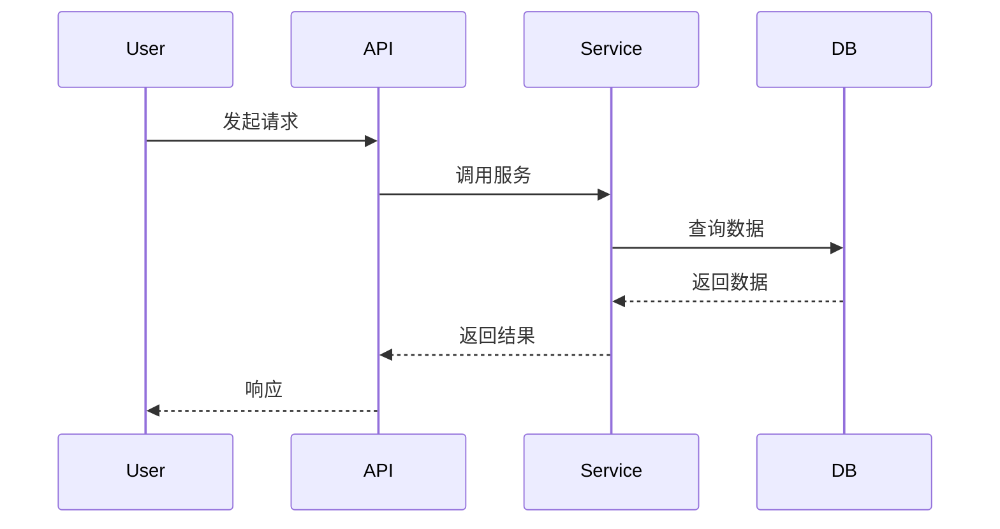
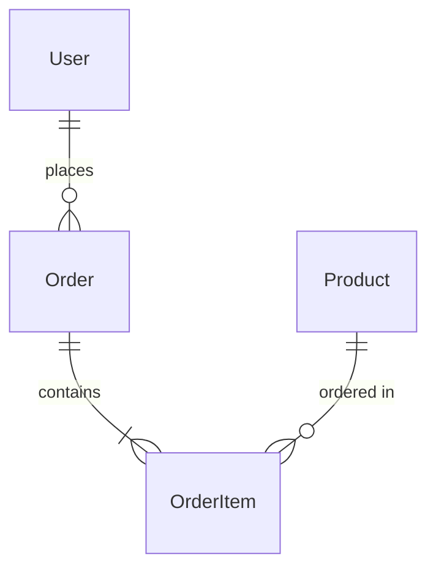

# 技术设计文档模板

本文档用于撰写技术设计方案，描述产品的技术架构、实现方案和关键技术决策。

## 文档信息

| 字段 | 内容 |
|------|------|
| 文档名称 | [项目/功能名称] 技术设计文档 |
| 版本 | v1.0 |
| 创建日期 | YYYY-MM-DD |
| 作者 | [作者姓名] |
| 状态 | [草稿/评审中/已批准] |
| 关联 PRD | [PRD 文档链接] |

---

## 1. 文档修订历史

| 版本 | 日期 | 修订人 | 修订内容 |
|------|------|--------|----------|
| v1.0 | YYYY-MM-DD | [姓名] | 初始版本 |

---

## 2. 背景与目标

### 2.1 需求概述

简要描述要实现的功能需求，引用 PRD 中的关键内容。

### 2.2 技术目标

- **可扩展性**：系统如何支持未来业务扩展
- **性能**：核心性能指标要求
- **可用性**：可用性目标（如：99.9% SLA）
- **安全性**：安全合规要求

### 2.3 约束条件

- 技术栈限制
- 资源限制（人力、时间、预算）
- 遗留系统兼容性要求

---

## 3. 系统架构

### 3.1 整体架构

```
┌─────────────────────────────────────────────────────────┐
│                      [客户端层]                          │
│  Web Browser  │  Mobile App  │  Third-party Client      │
└─────────────────────────────────────────────────────────┘
                            │
                            ▼
┌─────────────────────────────────────────────────────────┐
│                    [网关/负载均衡层]                      │
│              API Gateway / Load Balancer                 │
└─────────────────────────────────────────────────────────┘
                            │
                            ▼
┌─────────────────────────────────────────────────────────┐
│                      [应用服务层]                         │
│   Service A  │  Service B  │  Service C                  │
└─────────────────────────────────────────────────────────┘
                            │
                            ▼
┌─────────────────────────────────────────────────────────┐
│                      [数据存储层]                         │
│     Database  │  Cache  │  Message Queue  │  Storage    │
└─────────────────────────────────────────────────────────┘
```

### 3.2 架构说明

描述各层级的职责和关键技术选型。

---

## 4. 核心模块设计

### 4.1 [模块名称1]

**模块职责**：描述该模块负责的功能

**关键类/组件**：

| 类/组件名称 | 职责 | 说明 |
|-------------|------|------|
| [ClassA] | 职责描述 | 补充说明 |

**核心流程**：

```
用户请求 → [组件1] → [组件2] → [组件3] → 返回结果
```

**时序图**（可选）：



---

### 4.2 [模块名称2]

（同上结构）

---

## 5. 数据模型设计

### 5.1 核心实体关系



### 5.2 数据表设计

#### 表名：[table_name]

| 字段名 | 类型 | 是否空 | 索引 | 说明 |
|--------|------|--------|------|------|
| id | BIGINT | NOT NULL | PK | 主键 |
| field1 | VARCHAR(64) | NOT NULL | INDEX | 字段说明 |
| field2 | INT | NULL | - | 字段说明 |
| created_at | DATETIME | NOT NULL | INDEX | 创建时间 |
| updated_at | DATETIME | NOT NULL | - | 更新时间 |

### 5.3 缓存设计

| 缓存Key | 数据结构 | 过期时间 | 更新策略 |
|---------|----------|----------|----------|
| [key_pattern] | String/Hash/List | X秒 | 主动更新/被动过期 |

---

## 6. API 设计

### 6.1 RESTful API

#### [功能名称]

**请求**：

```
POST /api/v1/resource
```

**请求参数**：

| 参数名 | 类型 | 必填 | 说明 |
|--------|------|------|------|
| param1 | String | 是 | 参数说明 |
| param2 | Integer | 否 | 参数说明 |

**请求示例**：

```json
{
  "param1": "value1",
  "param2": 100
}
```

**响应**：

```json
{
  "code": 0,
  "message": "success",
  "data": {
    "id": 123,
    "result": "..."
  }
}
```

**错误码**：

| 错误码 | 说明 |
|--------|------|
| 1001 | 错误说明 |
| 1002 | 错误说明 |

---

### 6.2 事件/消息设计（如适用）

| 事件名称 | 主题/队列 | 消息格式 | 触发条件 |
|----------|-----------|----------|----------|
| [event_name] | [topic] | JSON | 触发条件 |

---

## 7. 技术选型

| 技术领域 | 选型方案 | 备选方案 | 选择理由 |
|----------|----------|----------|----------|
| 后端框架 | [方案A] | [方案B] | 理由说明 |
| 数据库 | [方案A] | [方案B] | 理由说明 |
| 缓存 | [方案A] | [方案B] | 理由说明 |
| 消息队列 | [方案A] | [方案B] | 理由说明 |

---

## 8. 关键技术决策

### 8.1 [决策标题1]

**决策内容**：描述做出的技术选择

**背景**：为什么需要做这个决策

**方案对比**：

| 方案 | 优点 | 缺点 |
|------|------|------|
| 方案A | 优点1 | 缺点1 |
| 方案B | 优点2 | 缺点2 |

**最终选择**：方案X

**理由**：详细说明选择理由

---

### 8.2 [决策标题2]

（同上结构）

---

## 9. 安全设计

### 9.1 认证授权

- 认证方式：JWT / OAuth2 / Session
- 权限模型：RBAC / ABAC

### 9.2 数据安全

- 传输加密：HTTPS/TLS
- 存储加密：敏感字段加密
- 数据脱敏：日志和监控中的敏感数据处理

### 9.3 防护措施

- SQL 注入防护
- XSS 防护
- CSRF 防护
- 接口限流/熔断

---

## 10. 监控与运维

### 10.1 监控指标

| 指标类型 | 具体指标 | 告警阈值 |
|----------|----------|----------|
| 业务指标 | 订单量、成功率 | - |
| 应用指标 | QPS、响应时间、错误率 | QPS > X, 延迟 > Y |
| 系统指标 | CPU、内存、磁盘 | CPU > 80% |

### 10.2 日志规范

- 日志级别：DEBUG / INFO / WARN / ERROR
- 日志格式：JSON / 结构化
- 关键日志：请求链路追踪 (TraceID)

### 10.3 部署方案

- 部署环境：开发/测试/预发布/生产
- 部署方式：容器化 (Docker/K8s)
- 回滚策略：版本回滚机制

---

## 11. 测试策略

| 测试类型 | 覆盖范围 | 责任人 |
|----------|----------|--------|
| 单元测试 | 核心业务逻辑 | 开发 |
| 集成测试 | 接口联调 | 开发 |
| 性能测试 | 压力测试、容量评估 | 测试 |
| 安全测试 | 漏洞扫描、渗透测试 | 安全 |

---

## 12. 附录

### 12.1 参考文档

- [相关技术文档链接]

### 12.2 待决策事项

| 事项 | 负责人 | 截止日期 |
|------|--------|----------|
| [待决策项] | [姓名] | YYYY-MM-DD |
